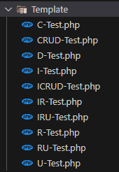

---
layout:
  title:
    visible: true
  description:
    visible: false
  tableOfContents:
    visible: true
  outline:
    visible: true
  pagination:
    visible: true
---

# 📑 Explanation

This package is quite simple to understand. It uses the dependencies of the Laravel framework to work well in a project using the same technology.

This package includes :

* the service provider`UnitTestsServiceProvider`, in order to publish the files,
* the configuration file `unit-tests.php`, to integrate the package into the desired project,
* a test dedicated to authentication called `AuthenticationTest`,
* the command defined in the `TestMakeCommand` to generate tests,
* and finally, several configuration files for running tests in a Laravel project.

Once the files have been published and the configuration updated, the test command can be used to test authentication.

## Templates

When it comes to creating new tests (see the add test page first), the package uses the class `GeneratorCommand` to create a new test file from a template. Roughly speaking, we'll replace certain parts of the template with specific information such as the namespace or class name, for example.

As far as these templates are concerned, I've divided the actions into several different files (Index, Create, Read, Update, Destroy) in order to validate several functionalities of a data model according to its available events :

<figure><figcaption><p>Laravel Unit Tests - templates</p></figcaption></figure>

For example, if I want to test a model called **Tag** has only **Index** and **Update** functionality, so the command to create this test will be :

```
php artisan make:laravel-unit-test Tag --only=index,update
```

The result will be a file named `TagTest.php` with tests on I**ndexing** and **Updating** the data model.

## Tests

Each test template is based on the `ICRUD-Test.php` which has all the tests for all the planned actions.

This file contains tests that validate the view, the route and the post information action.

Now you know how [Laravel Unit Tests](https://packagist.org/packages/alexis-gss/laravel-unit-tests) package works.&#x20;
